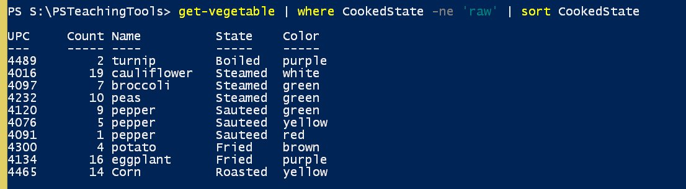

# PSTeachingTools

[](https://www.powershellgallery.com/packages/PSTeachingTools/) [](https://www.powershellgallery.com/packages/PSTeachingTools/)

## Installation

Install this module from the PowerShell Gallery:

```powershell
Install-Module psteachingtools [-scope currentuser]
```

If you are installing this module on PowerShell 7.x, you may need to include the `-scope currentuser` parameter. __Do not__ attempt to download and install from this repository unless you are an experienced PowerShell user.

The module should work in both Windows PowerShell and PowerShell 7, including cross-platform. Please post an issue with any feedback, suggestions, or problems.

## :teacher: Teaching PowerShell

This PowerShell module includes tools and techniques for teaching PowerShell. Many of the commands will create a set of sample objects and commands that can be used to demonstrate a variety of PowerShell techniques and concepts without having to worry about anything technical like Active Directory, services, or file objects.

* [Get-Vegetable](docs/Get-Vegetable.md)
* [Set-Vegetable](docs/Set-Vegetable.md)
* [Remove-Vegetable](docs/Remove-Vegetable.md)
* [New-Vegetable](docs/New-Vegetable.md)

Once the module is imported, you can use these commands like any other PowerShell command.




Beginning in v4.0.0 of this module, the custom vegetable objects are exposed as publically-defined objects with a variety of properties and methods. Some of the properties are read-only. Associated enumerations are also now publically available.

```powershell
PS C:\> Get-Vegetable Corn | Get-Member

   TypeName: PSTeachingTools.PSVegetable

Name        MemberType Definition
----        ---------- ----------
Equals      Method     bool Equals(System.Object obj)
GetHashCode Method     int GetHashCode()
GetType     Method     type GetType()
Peel        Method     void Peel()
Prepare     Method     void Prepare(PSTeachingTools.VegStatus State)
ToString    Method     string ToString()
Color       Property   PSTeachingTools.VegColor Color {get;}
CookedState Property   PSTeachingTools.VegStatus CookedState {get;set;}
Count       Property   int Count {get;set;}
IsPeeled    Property   bool IsPeeled {get;set;}
IsRoot      Property   bool IsRoot {get;}
Name        Property   string Name {get;}
UPC         Property   int UPC {get;}

PS C:\> [PSTeachingTools.VegStatus]::Sauteed
Sauteed
```

The PSVegetable object also has a custom format file with defined table views.

The primary idea behind these commands is that you can use them to teach core PowerShell concepts and techniques. Once the student understands how vegetable objects work in the pipeline, it is a small step to files, processes, and services.

See the [about_psteachingtools](docs/about_PSTeachingTools.md) help file for more information.

## :robot: Typed Demos

The module also includes a function for simulating an interactive PowerShell console session. You can type your commands in a file and have the function "play back" the commands just as if you were typing the commands. The function will pause after every `|` character. Pressing `Enter` will advance the demo. The commands from the demo file will also be added to the session's command history.

### Live Commands

Starting in v4.1.0, you can insert `<live>` into your demo file. When `Start-TypedDemo` reaches this line, it will let you enter a live command. Enter a command carefully and without error. Backspaces will break this step. Due to timing, the first key stroke may not be detected. This feature should be considered *experimental*.

Read command help for [Start-TypedDemo](docs/Start-TypedDemo.md). A [sample file](samples/sampledemo.txt) is included in this module.
Learn more about PowerShell: http://jdhitsolutions.com/blog/essential-powershell-resources/

## Sponsorship

If you find this module helpful or valuable, especially if used in a commercial setting, a small token of sponsorship would be deeply appreciated.
